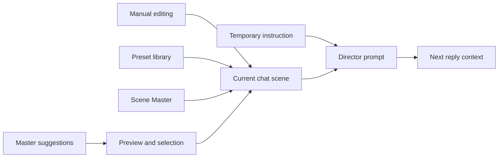

# 🎬 BB Scene Director

[Русский](README.md) · **English** · [Changelog](CHANGELOG.md#english)

Scene direction tools for **SillyTavern**. Control atmosphere, pacing and story focus with reusable directives, presets and a scene-specific prompt.

---

## ✨ Features

| Tool | What it does |
|---|---|
| 🎚️ **Directives** | Categories, 0–100% intensity, toggles and optional prompt descriptions |
| 🪄 **Scene Master** | Generates presets from chat context and your instructions |
| 📝 **Scene editing** | Previews suggested changes, applies selected edits and protects pinned directives |
| ⏳ **Temporary instructions** | Last for a chosen number of turns or until disabled |
| 🧩 **Presets** | Save, load, rename and exchange presets as JSON |
| 💬 **Separate scenes** | Keep directives and pause state for each regular or group chat |
| ↩️ **Edit history** | Undo and redo up to 20 unsaved changes |
| 🔎 **Search and prompt** | Find directives, preview the prompt and insert it automatically or with `{{bb_scene}}` |
| 📱 **Drawer** | Use the scene, editor and preset controls on desktop and mobile screens |

The Scene Director tab can be dragged vertically to move it out of the way; its position is saved. Drag the tab horizontally to reveal the drawer progressively while holding the pointer or finger. A normal click still opens or closes the panel.

## 🧭 How scene direction works

Directives describe how the model should stage the current scene. Their intensity expresses emphasis, not event probability. The active scene is assembled from manual changes, presets or a generated master preset, then added to the director prompt for the next reply.

## 🖼️ Interface

The drawer contains the current scene, Scene Master controls and the directive editor. On narrow screens, move the tab vertically before opening the drawer if it overlaps another control.

## 📦 Installation

1. Open SillyTavern.
2. Go to **Extensions → Install extension**.
3. Enter `https://github.com/maxkara14/BB-Scene-Director`.
4. Reload the page.
5. Click the clapperboard icon in the active chat to open Scene Director.

## 🚀 Quick start

1. Create or load a preset.
2. Adjust categories and directives manually or use Scene Master.
3. Review the resulting prompt in the preview.
4. Enable automatic insertion or use the `{{bb_scene}}` macro.

## 🪄 Scene Master

Scene Master can build a new preset from the active character, persona, scenario and other available SillyTavern context.

### Generation request

Choose a generation focus such as reusable genre style or a concrete scene. You can also describe the desired style in your own words. The requested focus has priority, while character and world information remains context.

Choose a compact or regular preset size and whether directive descriptions should be generated. Generated results are saved as a separate preset and can be reviewed before use.

### Connection

Generation can use the current SillyTavern connection, a saved Connection Manager profile or a separate OpenAI-compatible API. A separate API requires its URL, API key and model.

## 📝 Editing the current scene

The editor shows proposed changes as a before/after preview. Apply selected changes, keep pinned directives protected and discard suggestions without changing the active scene.

## 🎚️ Panel and directive editor

Each category can be enabled independently. Edit directive names, descriptions and intensity values, then save the preset or apply the scene to the current chat.

### Intensity scale

Intensity ranges from 0 to 100%. It tells the model how strongly to follow a directive and does not represent a probability or a guaranteed plot event.

## 🔎 Scene search

Search the active scene to quickly find a directive or category, then inspect its description and current intensity before editing it.

## ⏳ Temporary instruction

Add a one-off instruction for 1, 3 or 5 turns, or keep it active until you disable it manually. Temporary text is included in the director prompt without changing the saved preset.

## 🧩 Presets, history and export

Presets are stored in a shared library and can be renamed, duplicated, imported or exported as JSON. Unsaved edits keep an undo/redo history of up to 20 steps.

## 💬 Separate chat scenes

Each regular or group chat can keep its own directives, pause state and temporary instruction. Switching chats does not overwrite another chat's scene.

## 🧠 Prompt integration

Scene Director can insert its prompt automatically, or you can place `{{bb_scene}}` wherever the scene direction should appear. If the macro is absent, automatic insertion uses the configured prompt location.

## 🔌 Compatibility

- Standard SillyTavern chat mode.
- User personas and macros.
- `BB Visual Novel Engine` when both extensions are installed.

## 🛠️ Development

The extension is plain JavaScript and CSS. From the extension directory, run `node --test` to execute the available Node.js tests. Browser and network dependencies are replaced with test doubles; no real API keys or chats are required.

## 👤 Author

- [BruniikBron: Lo-Fi & Mods](https://bblofi.online/)
- [Telegram](https://t.me/Brun11kBr0n)

## 🤝 Thanks

The extension was created with help from uncle Maks.

- [Maks_Sh](https://t.me/btwiusesillytavern)
