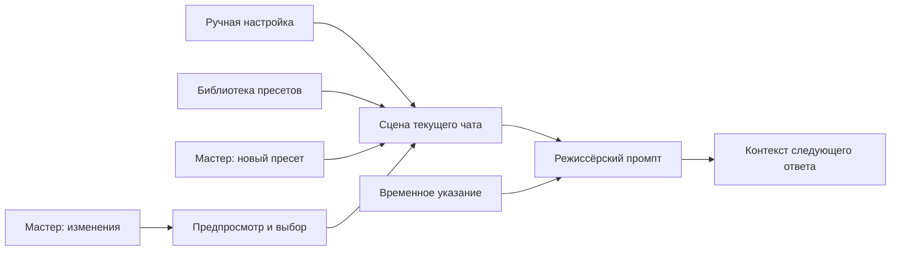
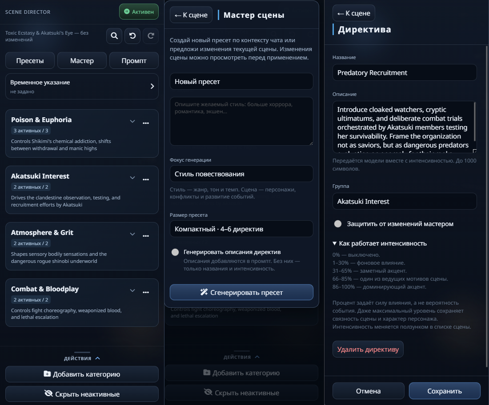

# 🎬 BB Scene Director

[English documentation](README.en.md)

Пульт режиссуры сцены для **SillyTavern**. Управляйте атмосферой, темпом и сюжетным фокусом через директивы: от коротких жанровых акцентов до подробных указаний для конкретной сцены.

Настройте сцену вручную или попросите мастера предложить пресет. Итоговый режиссёрский промпт можно проверить перед ответом персонажа, а изменения мастера — просмотреть и принять выборочно.

---

## ✨ Что умеет

| Блок | Возможности |
|---|---|
| 🎚️ **Директивы** | Группы, интенсивность 0–100%, включение и необязательные описания для промпта |
| 🪄 **Мастер сцены** | Новый пресет по контексту и пожеланию; выбор фокуса, размера и генерации описаний |
| 📝 **Изменение сцены** | Предложения с предпросмотром «было → станет», выборочное применение и защита закреплённых директив |
| ⏳ **Временные указания** | Отдельное пожелание на 1, 3, 5 ходов или до ручного отключения |
| 🧩 **Пресеты** | Общая библиотека, сохранение, загрузка, переименование и JSON-обмен |
| 💬 **Отдельные сцены** | Собственные директивы, пауза и временное указание в каждом обычном или групповом чате |
| ↩️ **История правок** | Статус несохранённых изменений и отмена/повтор до 20 шагов |
| 🔎 **Поиск и промпт** | Поиск по сцене, просмотр инструкции, автоматическая вставка или макрос `{{bb_scene}}` |
| 📱 **Панель** | Карточки групп, редактор директив и компактные окна мастера и пресетов на компьютере и телефоне |

---

## 🧭 Как работает режиссура

Директивы влияют на то, как модель ведёт сцену. Проценты задают силу акцента, а не вероятность события; следование указаниям зависит от модели.

## 🖼️ Интерфейс

Основная сцена, мастер генерации и редактор директивы.

---

## 📦 Установка

1. Откройте SillyTavern.
2. Перейдите в `Расширения -> Установить расширение`.
3. Вставьте ссылку на репозиторий:
   `https://github.com/maxkara14/BB-Scene-Director`
4. Перезагрузите страницу.
5. В активном чате нажмите на иконку хлопушки, чтобы открыть панель Scene Director.

---

## 🚀 Быстрый старт

1. Создайте или загрузите пресет.
2. Настройте категории и директивы вручную или через мастер-генерацию.
3. Проверьте итоговый промпт в предпросмотре.
4. Используйте авто-вставку или макрос `{{bb_scene}}`.

---

## 🪄 Мастер сцены

Scene Director умеет собирать новый пресет по текущему контексту SillyTavern: персонажу, персоне, сценарию и другим доступным макросам.

### Генерация по запросу

«Фокус генерации» применяется только к новому пресету. «Стиль повествования» просит переиспользуемые жанровые директивы про тон, атмосферу и темп, без придуманных сюжетных событий. «Конкретная сцена» просит директивы про персонажей, конфликты и развитие сцены по контексту; этот вариант выбран по умолчанию как наиболее близкий к прежней генерации. Явное пожелание пользователя может изменить подход. Выбор запоминается в общих настройках мастера, независимо от размера и описаний; в сам пресет отдельная метка фокуса не записывается. При изменении сцены мастер ориентируется на её содержимое. Следование фокусу зависит от модели.

«Размер пресета» задаёт ориентир для нового результата: «Компактный» — 4–6 директив в 2–3 группах, «Обычный» — 6–14 директив в 3–7 группах. Обычный выбран по умолчанию; выбор запоминается независимо от галочки описаний. Количество — инструкция модели, а не жёсткий предел: результат не обрезается автоматически. Компактный вариант допускает минимум 4 директивы; обычный сохраняет прежнюю проверку качества. При изменении текущей сцены настройка скрыта и не применяется.

Для нового пресета можно выключить «Генерировать описания директив»: результат будет содержать названия и интенсивность без описаний директив. Подсказки групп остаются. Настройка включена по умолчанию, запоминается для мастера и не удаляет описания из существующих пресетов. В режиме изменения сцены переключатель скрыт: мастер получает инструкцию сохранять текущий жанровый или сюжетный подход и не добавлять отсутствующие описания без явного запроса. Проверяйте предложения перед применением — следование этим правилам зависит от модели.

Можно описать желаемый стиль прямо в текстовом поле над кнопкой генерации: «больше хоррора», «романтика и интрига», «экшен с юмором» — на любом языке. Запрос пользователя становится главным приоритетом: категории, директивы и их значения адаптируются под пожелание, а данные персонажа используются как контекст. Если поле оставить пустым, пресет собирается по контексту персонажа как раньше.

### Подключение

Для генерации можно выбрать текущее подключение SillyTavern, сохранённый профиль Connection Manager или отдельный OpenAI-compatible API. Для отдельного API указываются:

- `URL`
- `API-ключ`
- `Модель`

При ошибке отдельного API генерация по умолчанию останавливается. Автоматическую отправку запроса основному подключению можно явно включить в настройках генератора. При использовании резерва появляется уведомление.

Сгенерированный результат сохраняется как отдельный пресет и применяется в панели. Перед генерацией расширение спрашивает о замене сцены, если в ней есть изменения, не сохранённые в пресет. Если сцена изменилась за время запроса, результат только сохраняется в библиотеку: его можно выбрать и загрузить вручную.

---

## 📝 Изменение текущей сцены

В блоке мастера выберите «Изменить текущую сцену», опишите нужную правку и нажмите «Предложить изменения». По умолчанию учитываются последние 10 сообщений всех участников; можно выбрать 0, 5 или 20. Системные сообщения исключаются, длинный контекст обрезается в пользу последних событий.

В отдельном окне отметьте нужные изменения и нажмите «Применить выбранное». Применение меняет текущую сцену и отменяется одним действием; сохранённый пресет в библиотеке остаётся прежним. Для его обновления используйте сохранение пресета.

Замок рядом с интенсивностью защищает директиву при изменении сцены мастером. Закрепление сохраняется вместе со сценой и при экспорте пресета. Ручное редактирование и явная загрузка или генерация нового пресета остаются доступны. На этом этапе мастер меняет директивы внутри существующих категорий.

---

## 🎚️ Панель и редактор директивы

В основной панели «Пресеты» и «Мастер» открывают компактные окна поверх затемнённой сцены. Высота зависит от содержимого; при нехватке места прокручивается тело окна. «К сцене», Escape или нажатие на затемнённую область панели закрывает окно и возвращает фокус и прежнюю позицию списка. Введённое пожелание мастеру сохраняется при переходах в текущей странице. При смене чата окно закрывается. «Промпт» открывает отдельный полный экран.

Пауза находится в шапке рядом с Scene Director, отмена/повтор — рядом со статусом сцены. Нажатие на блок временного указания открывает его отдельный экран. «Применить» и «Отключить» возвращают к списку; «К сцене» оставляет введённый текст неприменённым. В списке видны оставшийся срок и первые две строки активного указания, полный текст доступен при открытии.

На экране пресетов доступны прежние загрузка, сохранение, переименование, удаление и импорт/экспорт с явными подписями. Просмотр промпта занимает отдельный экран и прокручивается целиком. Подключение генератора по-прежнему настраивается в настройках расширения.

Группы выделены отдельными карточками; раскрытая группа подсвечена сильнее. Рядом с названием директивы постоянно виден карандаш, а при наведении или фокусе появляется подсветка. Нажми название с карандашом, чтобы открыть редактор внутри панели. Здесь можно изменить название, описание, группу и защиту от изменений мастером. Поле описания необязательное, до 1000 символов. «Сохранить» применяет все поля одним шагом отмены; «Отмена» и «К сцене» возвращают список без применения правок. Например: «Усиливай напряжение через короткие паузы, недоговорённость и внимание к звукам».

Описание активной директивы добавляется в промпт рядом с её названием и интенсивностью. Оно сохраняется в чате и пресете, переносится через JSON и участвует в отмене/повторе. Старые пресеты работают с пустыми описаниями. Мастер изменения сцены получает описания; если в предложенном обновлении описание отсутствует, сохраняется прежнее. Изменения описаний видны в предпросмотре.

Если включена настройка «Генерировать описания директив», мастер новых пресетов получает требование генерировать короткое описание каждой директивы. Оно поддерживается в JSON и запасном построчном ответе; старые пресеты без описаний продолжают работать.

Название и описание группы меняются через «···» в её заголовке. Это подсказка панели: она сохраняется со сценой и пресетом, поддерживает отмену/повтор, но не входит в режиссёрский промпт. Пустое поле убирает подсказку. Изменение отображаемого названия группы сохраняет её прежний заголовок в промпте. Удаление группы также доступно из редактора и требует подтверждения; удаление директивы можно отменить через Undo.

При смене чата или изменении сцены открытый редактор закрывается, а несохранённые поля не применяются к новой сцене. Интенсивность и включение остаются доступны прямо в списке; добавление директивы находится внизу группы.

### Шкала интенсивности

Интенсивность имеет общую шкалу: 0% — выключено, 1–30% — фоновое влияние, 31–65% — заметный акцент, 66–85% — один из ведущих мотивов сцены, 86–100% — доминирующий акцент. Проценты обозначают силу влияния, а не вероятность события. Шкала добавляется один раз в промпт с директивами; её пояснение доступно в редакторе директивы под «Как работает интенсивность». Максимум сохраняет связность сцены и характер персонажа; следование инструкции зависит от модели.

---

## 🔎 Поиск по сцене

Кнопка с лупой рядом с отменой/повтором открывает поиск по названию и описанию директивы или названию группы. Регистр не учитывается. Совпадение с названием группы показывает все её директивы с учётом «Скрыть неактивные». Число результатов и состояние этого фильтра видны под полем.

Во время поиска группы с результатами раскрыты; сворачивание временно недоступно. Крестик очищает запрос и возвращает прежнее раскрытие групп. Повторное нажатие лупы или Escape закрывает поиск и очищает запрос. При смене чата поиск сбрасывается. Поиск не меняет промпт, сцену и историю отмены.

---

## ⏳ Временное указание

Откройте блок «Временное указание», введите пожелание и выберите срок: 1, 3, 5 ходов или до ручного отключения. Нажмите «Применить». Повторное применение запускает срок заново; «Отключить» сохраняет текст.

Один ход начинается вашим сообщением и заканчивается отправкой следующего. Например: включить указание на 1 ход → отправить сообщение → получить ответ и сколько угодно его перегенерировать → отправить следующее сообщение, после чего указание завершится. Если при включении последнее несистемное сообщение в чате уже ваше, оно считается началом текущего хода.

Счётчик меняется только при отправке нового сообщения пользователя. Ответы персонажей, рероллы, продолжения, отмены и ошибки генерации на него не влияют. В группе все ответы между двумя вашими сообщениями входят в один ход. Отправка следующего сообщения завершает ход даже без успешного ответа персонажа.

Указание работает вместе с обычными директивами, в том числе в пустой сцене. Общая пауза приостанавливает действие и отсчёт. Текст и оставшийся срок сохраняются отдельно в каждом чате, но не входят в экспорт пресета и историю отмены директив. Старые указания сохраняют оставшийся срок, который теперь считается в ходах; завершённые остаются завершёнными.

---

## 🧩 Пресеты, история и экспорт

- Строка над директивами показывает активный пресет и отличается ли текущая сцена от сохранённой версии. Черновик автоматически сохраняется в метаданных текущего чата; отметка «изменён» означает, что изменения ещё не записаны в пресет.
- «Отменить» и «Повторить» восстанавливают директивы, категории и активный пресет. Одно перетаскивание ползунка считается одной правкой. История хранит до 20 шагов до перезагрузки страницы или смены чата.
- История относится к рабочей сцене: сохранение, перезапись и удаление пресетов в библиотеке не отменяются этими кнопками. Пауза и настройки подключения также не входят в историю.
- Загрузка другого пресета спрашивает подтверждение, если текущая сцена изменена. Загрузку и применение сгенерированного пресета можно отменить.
- «Экспорт сцены» выгружает текущие значения панели. «Экспорт пресета» выгружает сохранённую версию пресета, выбранного в списке, даже если текущая сцена отличается.

---

## 💬 Раздельные сцены чатов

Библиотека пресетов, подключение генератора и оформление панели остаются общими. Текущая сцена сохраняется в метаданных чата; переключение чата восстанавливает его директивы, категории, паузу и активный пресет. Сохранённые пресеты связываются по ID, поэтому удаление другого пресета из библиотеки не меняет привязку.

При первом запуске SD-2 прежняя общая сцена переносится в первый открытый чат. Если в ней есть директивы, в библиотеке дополнительно появляется пресет «Общая сцена до SD-2». Остальные чаты без собственной сцены начинаются пустыми, со снятой паузой. Пустой чат можно настроить вручную или загрузить в него любой общий пресет.

Смена чата отменяет незавершённую генерацию и очищает историю отмены. Если чат или сцена изменились во время подтверждения замены, действие нужно повторить в текущем чате. При отсутствии открытого чата Scene Director не добавляет промпт.

---

## 🧠 Интеграция в промпт

- В обычном режиме расширение автоматически вставляет активный режиссёрский промпт в контекст.
- В ручном режиме можно использовать макрос `{{bb_scene}}` в своих пресетах.
- При включённом макросе авто-вставка отключается, а инструкция разворачивается только там, где указан `{{bb_scene}}`.

---

## 🔌 Совместимость

- Обычный режим SillyTavern.
- Пользовательские персоны и макросы.
- `BB Visual Novel Engine`, если вы используете оба расширения вместе.

---

## 👤 Автор

- [BruniikBron: Lo-Fi & Mods](https://bblofi.online/)
- [Telegram](https://t.me/Brun11kBr0n)

---

## 🤝 Благодарности

Идея расширения родилась при участии дяди Макса.

- [Maks_Sh](https://t.me/btwiusesillytavern)
